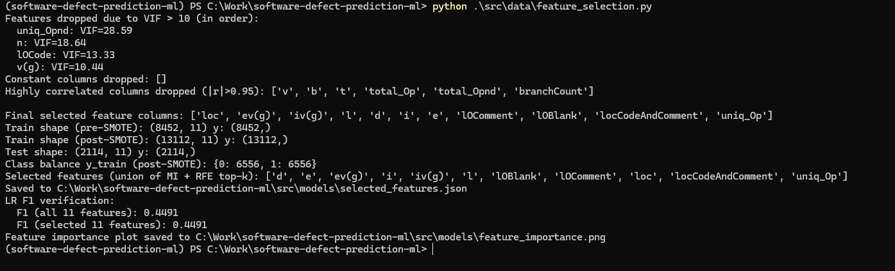
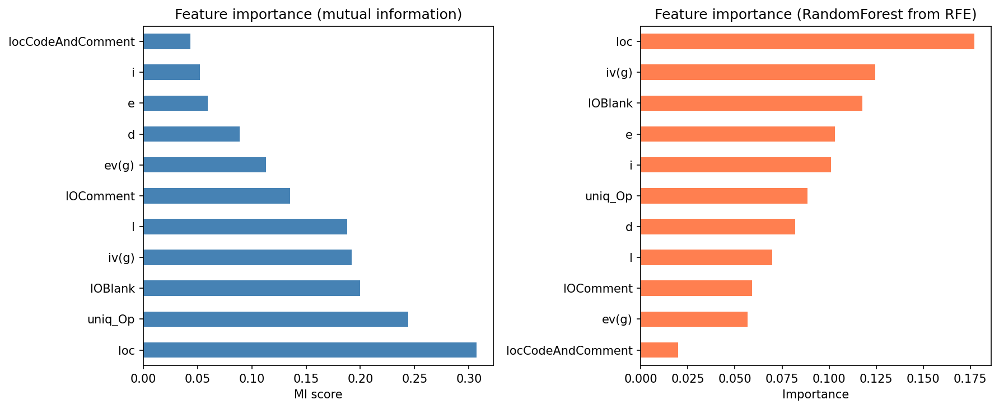

## AI/ML Software Defect Prediction

**Student**: Azka Noor (ID: 24091601)  
**Module**: 7COM1040 — Computer Science Masters Project  
**University**: University of Hertfordshire  
**Project Duration**: 25 February 2026 – 10 April 2026 (6.5 weeks)

This repository contains the research code and assets for a masters project on **software defect prediction using classical machine learning and explainable AI (XAI)**. The work focuses on predicting defect-prone modules from static code metrics and analysing model behaviour using modern explainability techniques.

### Project Objectives

- **Defect Prediction**: Build and evaluate machine learning models that predict whether a software module is defect-prone using static code metrics.
- **Benchmarking**: Use widely-cited PROMISE / NASA datasets as the primary benchmark for training and evaluation.
- **Explainability**: Apply XAI methods (e.g., SHAP, LIME) to interpret model predictions for both global feature importance and individual modules.
- **Automation & Reproducibility**: Structure the project with a clear directory layout and automation hooks so that experiments can be reproduced reliably.

### Datasets

The project is based on the **PROMISE Repository** family of **NASA defect datasets**, which provide static code metrics and binary defect labels at the module level. The primary datasets used are:

- **KC1** — C++ flight software
- **CM1** — NASA spacecraft instrument
- **PC1** — NASA flight software
- **JM1** — NASA real-time predictive system
- **KC2** — C++ scientific software

Each dataset includes Halstead metrics, McCabe complexity measures, size metrics (e.g., LOC), and a binary target label indicating whether a module is defective. Mirrors of these datasets are also available in platforms such as **OpenML**, which can be used if the primary PROMISE sources are slow or unavailable.

### Data Preprocessing & Feature Selection

Data preparation and feature selection are implemented in `src/data/preprocessing.py` and `src/data/feature_selection.py`. The pipeline is designed for reproducibility and is used both for training and for serving (via a saved pipeline artifact).

#### Preprocessing pipeline (`src/data/preprocessing.py`)

1. **Train/test split** — Stratified split (default 80/20) on the binary target `label`, so class proportions are preserved.
2. **Feature cleanup** (on training data only, then applied to test):
   - Drop **constant** columns.
   - Drop one from each pair of features with **absolute correlation > 0.95**.
   - Iteratively drop features with **VIF > 10** (variance inflation factor) to reduce multicollinearity.
3. **Transformation pipeline** — An imbalanced-learn pipeline is built and fit on the training set:
   - **Imputation**: missing values filled with the **median** (per feature).
   - **Scaling**: **RobustScaler** (median and IQR) for robustness to outliers.
   - **Resampling**: **SMOTE** applied only on the training data to address class imbalance; the test set is never resampled.
4. **Artifacts** — The fitted pipeline, selected feature list, and meta (dropped columns, VIF history) can be saved to a single `.pkl` file (e.g. `src/models/pipeline.pkl`) for reuse in evaluation and API serving.



#### Feature selection (`src/data/feature_selection.py`)

Feature selection combines two ranking methods and takes their **union**:

- **Mutual information (MI)** — Ranks features by MI with the target; top-*k* (default *k* = 12) are kept.
- **RFE with Random Forest** — Recursive Feature Elimination using a Random Forest classifier; the same *k* features are selected.

The **selected feature set** is the union of the top-*k* from MI and the top-*k* from RFE, then saved to `src/models/selected_features.json`. An optional **verification** step trains a Logistic Regression on all features vs. selected features and compares F1 on the held-out test set. A feature-importance figure is generated comparing both methods.



*Left:* Feature importance by mutual information (MI score). *Right:* Feature importance from the Random Forest used inside RFE. Metrics such as `loc` (lines of code), `uniq_Op` (unique operators), `IOBlank`, and `iv(g)` consistently rank highly; `locCodeAndComment` is among the least important in both views.

> Note: Further implementation details (data loading, model training, CI/CD, and XAI pipelines) are tracked in separate documentation and notebooks.

### High-Level Project Phases

1. **Phase 1 — Data Acquisition & Exploratory Analysis**  
   Collect PROMISE / NASA datasets, perform basic exploratory data analysis (EDA), and understand class imbalance and feature distributions.
2. **Phase 2 — Feature Engineering & Preprocessing**  
   Prepare the data for modelling via `src/data/preprocessing.py` (stratified split, constant/correlation/VIF removal, median imputation, RobustScaler, SMOTE on train only) and `src/data/feature_selection.py` (MI + RFE union, selected features and importance plots). See [Data Preprocessing & Feature Selection](#data-preprocessing--feature-selection) above.
3. **Phase 3 — Model Development & Evaluation**  
   Train and compare multiple classical ML models for defect prediction, using robust validation and appropriate performance metrics.
4. **Phase 4 — CI/CD Integration**  
   Wrap the best-performing model in a lightweight API and integrate it into a continuous integration workflow for automated risk assessment on code changes.
5. **Phase 5 — Explainability & Thesis Write-Up**  
   Apply XAI techniques, analyse feature importance, and consolidate experimental results into the final thesis chapter and appendices.

### Repository Structure

Current layout of the project:

- **`data/`**: Data files (not all are necessarily committed to version control)
  - **`data/raw/`**: Original PROMISE / NASA datasets in ARFF format (e.g. CM1, KC1, PC1, JM1, KC2, MC1, MC2, MW1, PC2–PC4, KC3)
  - **`data/processed/`**: Cleaned and combined datasets ready for modelling (e.g. `promise_nasa_combined_clean.csv`)
- **`src/`**: Source code for the core project logic
  - **`src/data/`**: Data loading (`load_promise_nasa.py`), preprocessing (`preprocessing.py`), feature selection (`feature_selection.py`), and Jupyter notebooks for EDA and cleaning (`clean.ipynb`, `eda_final.ipynb`)
  - **`src/models/`**: Saved model artefacts (e.g. `pipeline.pkl`), selected feature list (`selected_features.json`), and model-related figures (`feature_importance.png`)
- **`figures/`**: Generated plots and diagrams for reports and the thesis (e.g. `preprocessing_feature_selection.png`)
- **`scripts/`**: Command-line scripts (e.g. `metrics_calc.py` for running workflows)
- **`requirements.txt`**: Python dependencies (used with a uv-managed `.venv`)

### Getting Started

This project uses a **uv-managed virtual environment** and an unpinned `requirements.txt` to keep the setup simple and reproducible.

#### 1. Install uv (Windows PowerShell)

Run the following command in **PowerShell** to install `uv`:

```powershell
powershell -ExecutionPolicy ByPass -c "irm https://astral.sh/uv/install.ps1 | iex"
```

After installation, restart your terminal if `uv` is not immediately available.

#### 2. Create a virtual environment with uv

From the project root:

```powershell
uv venv
```

This will create a `.venv` folder in the repository.

#### 3. Allow local scripts and activate the environment

In PowerShell, ensure local scripts can run and then activate the environment:

```powershell
Set-ExecutionPolicy -ExecutionPolicy RemoteSigned -Scope CurrentUser
```

You should see the virtual environment name (e.g. `.venv`) appear in your prompt.

#### 4. Install Python dependencies

With the environment activated, install all required libraries from `requirements.txt` using uv’s pip interface:

```powershell
pip install -r requirements.txt
.\.venv\Scripts\activate
```

At this stage, the environment will contain the full stack of libraries needed for data loading, preprocessing, model training, evaluation, explainability, and API / CI work described in the project plan. Detailed implementation steps are documented separately and are not covered here.